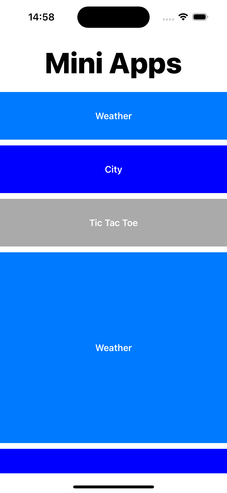
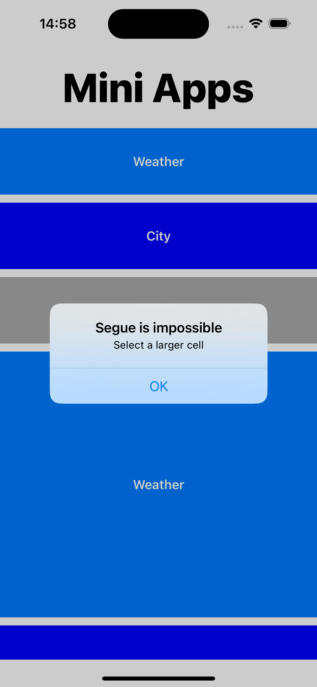
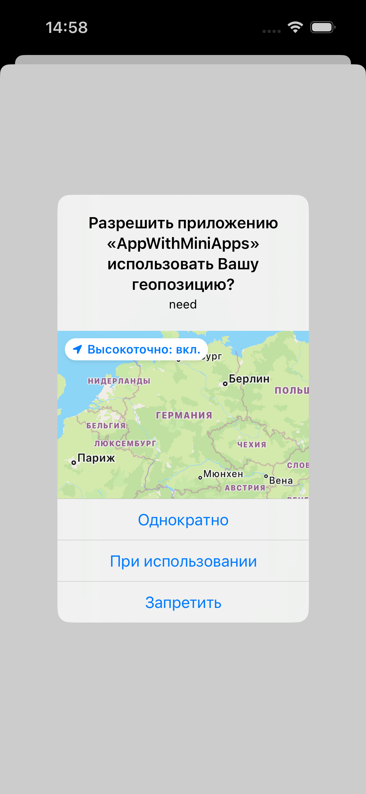
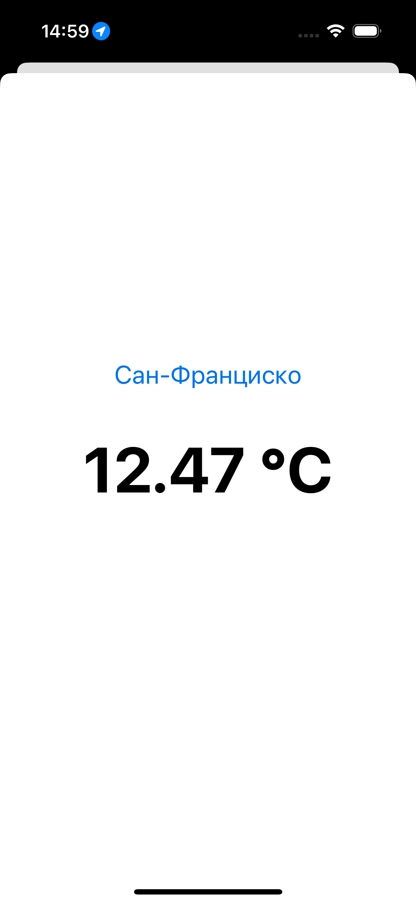
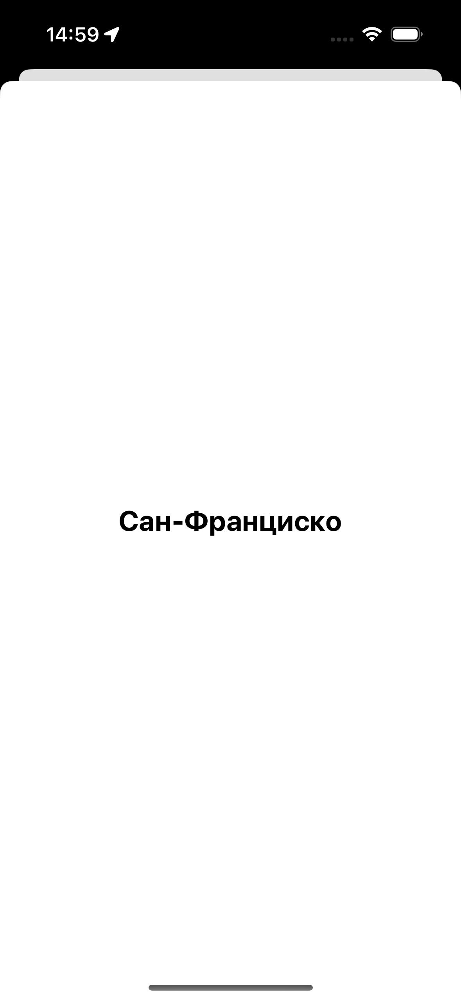
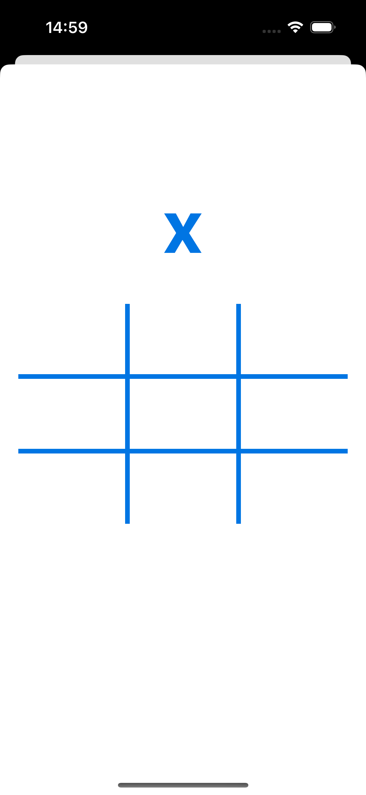
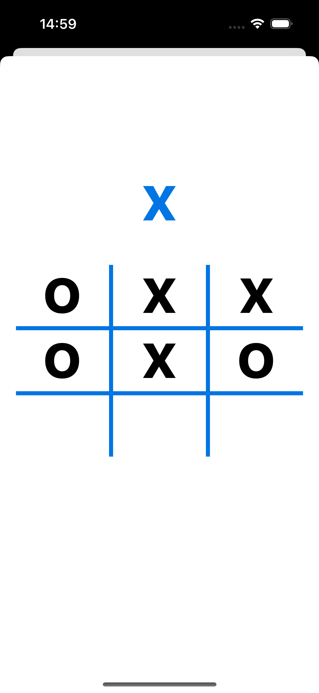
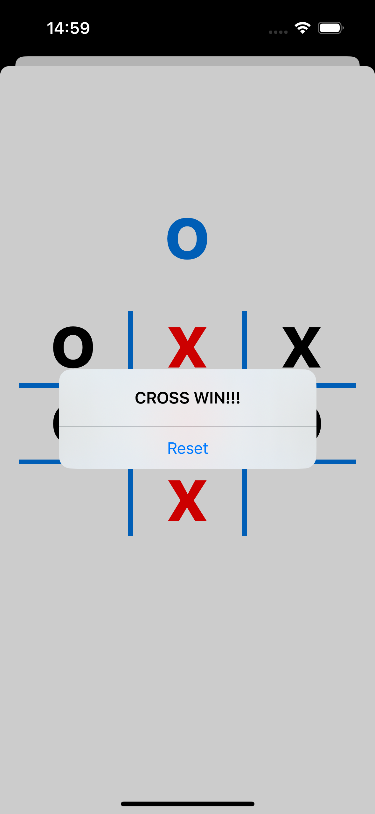

# App with mini apps

Приложение состоит из 4 экранов:

- Главный экран с списком мини-приложений
- Мини-приложение "Погода"
- Мини-приложение "Текущий город"
- Мини-приложение "Крестики-нолики"

## Главный экран

Главный экран содержит Collection View, состоящий из 10 элементов (P.S: элементы высотой 1/8 не доступны для пользователя)

Если пользователь кликнул на недоступный элемент

## Погода

При переходе в мини-приложение "Погода" у пользователя запрашивается разрешение на использование геопозиции

Затем показывается погода

## Текущий город

Экран данного мини-приложения выглядит следующим образом:

## Крестики-нолики

Экран данного мини-приложения выглядит следующим образом:

При нажатии на ячейку ставится Х или О в зависимости от текущего хода:

При победной комбинации символы окрашиваются в красный и выводится сообщение о победе

